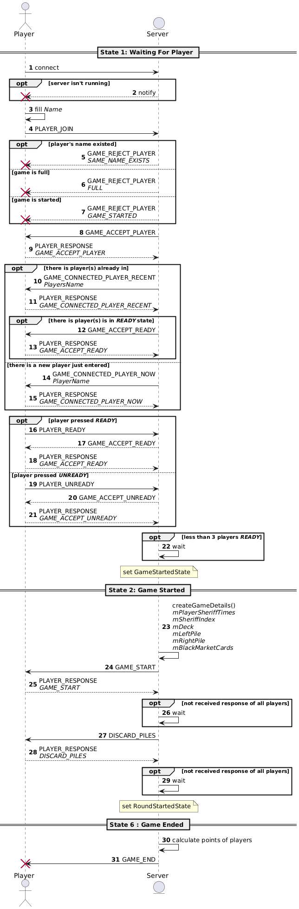
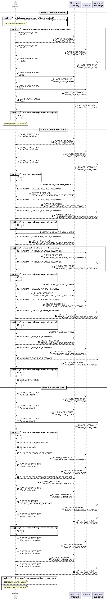

## Precondition
### Install dependencies
```
sudo apt-get update
sudo apt-get install build-essential cmake pkg-config libgtest-dev
```
## How to build the project
### Clone the project
```
git clone https://github.com/hhoang308/Sheriff-of-Nottingham-Server.git
```
### Build the project
```
./build.sh
```
default option is `--debug --server`
```
another options:
--debug : Build Sheriff of Nottingham with full logs
--release : Build Sheriff of Nottingham without debug logs
--run : Build Sheriff of Nottingham and run it (if it success)
--server : Build Sheriff of Nottingham
--tests : Build unit tests of Sheriff of Nottingham
--all : Build unit tests and Sheriff of Nottingham
--clean : Clean build directory
```
### Run the server
```
./build.sh --run
```
### [Optional] Clone googletest for unitest
```
git clone https://github.com/google/googletest.git
```
then execute unit tests
```
cd build/
ctest
```
## [Contribution] Commit message rule
```
<action> <subject> <optional extra information>

- <additional information>
```
### Sequence Diagram

